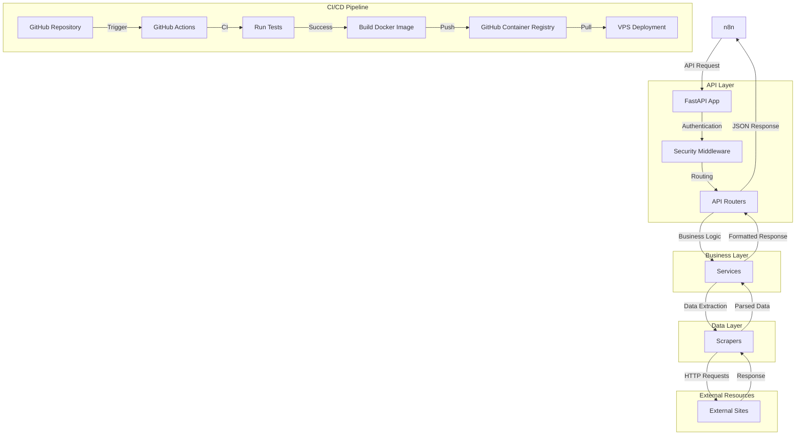
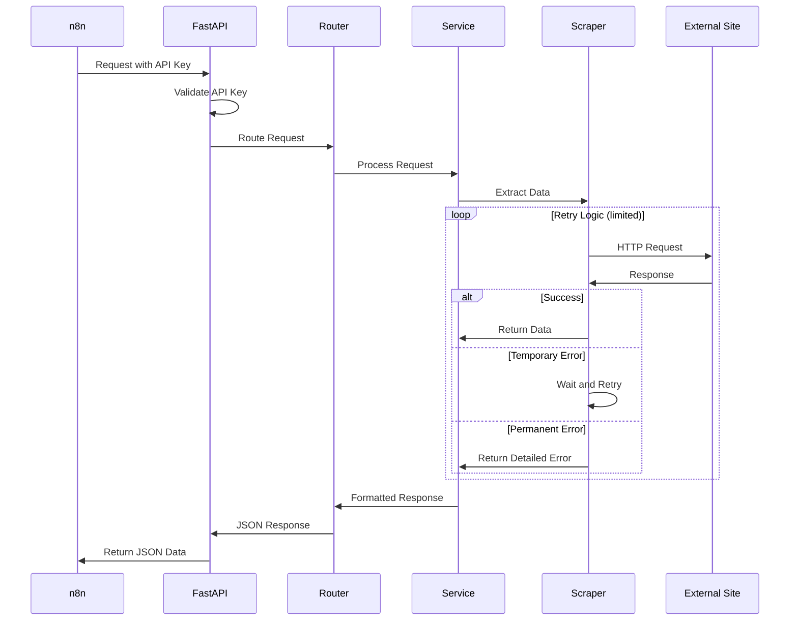
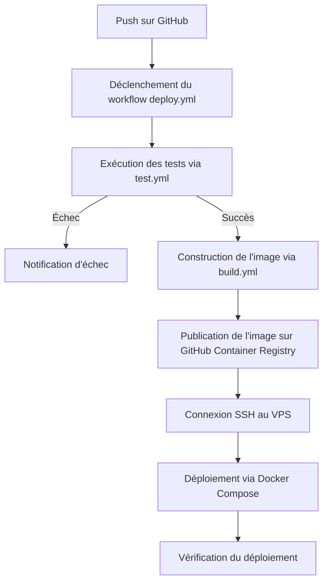

# Architecture du projet techno-scraper

Ce document décrit l'architecture du projet techno-scraper, une API FastAPI pour scraper des données de différents sites liés à la musique techno.

## Objectif du projet

Le projet techno-scraper vise à :

-   Scraper des données de sites musicaux (Soundcloud, Beatport, Bandcamp, Facebook, Instagram, Songstats)
-   Exposer ces données via une API FastAPI
-   Fonctionner en local et en production via Docker
-   Être utilisé par n8n sur un VPS

## Structure du projet

```
techno-scraper/
├── app/
│   ├── __init__.py
│   ├── main.py                  # Point d'entrée de l'application FastAPI
│   ├── core/                    # Fonctionnalités centrales
│   │   ├── __init__.py
│   │   ├── config.py            # Configuration de l'application
│   │   ├── security.py          # Gestion de l'authentification par clé API
│   │   └── errors.py            # Gestion des erreurs et exceptions
│   ├── models/                  # Modèles Pydantic pour la validation des données
│   │   ├── __init__.py
│   │   └── schemas.py           # Schémas de données communs
│   ├── routers/                 # Endpoints API
│   │   ├── __init__.py
│   │   ├── soundcloud.py        # Router pour Soundcloud
│   │   ├── beatport.py          # Router pour Beatport
│   │   ├── bandcamp.py          # Router pour Bandcamp
│   │   ├── facebook.py          # Router pour Facebook
│   │   ├── instagram.py         # Router pour Instagram
│   │   └── songstats.py         # Router pour Songstats
│   ├── services/                # Logique métier
│   │   ├── __init__.py
│   │   └── retry_service.py     # Service de retry avec backoff
│   └── scrapers/                # Modules de scraping
│       ├── __init__.py
│       ├── base.py              # Classe de base pour les scrapers
│       ├── soundcloud/          # Scraper pour Soundcloud
│       │   ├── __init__.py
│       │   ├── profile.py       # Scraping de profil
│       │   └── search.py        # Scraping de recherche
│       ├── beatport/            # Scraper pour Beatport
│       │   ├── __init__.py
│       │   ├── search.py        # Scraping de recherche
│       │   └── releases.py      # Scraping de releases
│       ├── bandcamp/            # Et ainsi de suite pour les autres sites...
│       ├── facebook/
│       ├── instagram/
│       └── songstats/
├── tests/                       # Tests unitaires et d'intégration
│   ├── __init__.py
│   ├── conftest.py              # Configuration des tests
│   ├── integration/             # Tests d'intégration
│   │   ├── mocks/               # Mocks pour les tests d'intégration
│   │   ├── test_api_routes.py   # Tests des routes API générales
│   │   └── test_soundcloud_router.py # Tests des routes Soundcloud
│   ├── mocks/                   # Mocks réutilisables
│   ├── scrapers/                # Tests unitaires des scrapers
│   │   ├── soundcloud/          # Tests pour Soundcloud
│   │   ├── beatport/            # Tests pour Beatport
│   │   └── ...                  # Tests pour autres scrapers
│   └── services/                # Tests des services
│       ├── test_retry_service.py # Tests du service de retry
│       └── ...
├── .github/                     # Configuration GitHub
│   └── workflows/               # Workflows GitHub Actions
│       ├── deploy.yml           # Workflow de déploiement principal
│       ├── build.yml            # Workflow de construction d'image Docker
│       ├── test.yml             # Workflow d'exécution des tests
│       └── manual-test.yml      # Workflow pour tests manuels
├── scripts/                     # Scripts utilitaires
│   ├── deploy.sh                # Script de déploiement pour GitHub Actions
│   ├── setup_venv.bat           # Script de config venv en local (Windows)
│   ├── setup_venv.sh            # Script de config venv en local (Linux/macOS)
│   ├── run_tests.bat            # Script d'exécution des tests (Windows)
│   └── run_tests.sh             # Script d'exécution des tests (Linux/macOS)
├── .env.example                 # Exemple de variables d'environnement
├── .gitignore                   # Fichiers à ignorer par Git
├── Dockerfile                   # Configuration Docker
├── docker-compose.yml           # Configuration Docker Compose
├── requirements.txt             # Dépendances Python principales
├── requirements-test.txt        # Dépendances pour les tests
├── pytest.ini                   # Configuration pytest
└── README.md                    # Documentation du projet
```

## Diagramme d'architecture



## Flux de données



## Flux de déploiement CI/CD



## Détails des composants principaux

### 1. API Layer (FastAPI)

-   **main.py**: Point d'entrée de l'application, configuration des middlewares et des routers
-   **core/security.py**: Middleware d'authentification par clé API
-   **routers/**: Endpoints API organisés par site (un router par site)

### 2. Business Layer (Services)

-   **services/retry_service.py**: Gestion des retries avec backoff exponentiel
-   Logique métier pour transformer les données brutes en réponses API

### 3. Data Layer (Scrapers)

-   **scrapers/base.py**: Classe de base avec fonctionnalités communes
-   Scrapers spécifiques à chaque site, organisés par fonctionnalité

### 4. Test Layer

-   **tests/conftest.py**: Configuration globale et fixtures partagées
-   **tests/integration/**: Tests d'intégration des API et endpoints
-   **tests/scrapers/**: Tests unitaires pour les scrapers
-   **tests/services/**: Tests unitaires pour les services
-   **tests/mocks/**: Mocks réutilisables pour simuler les réponses externes

### 5. Configuration Docker

-   **Dockerfile**: Image Docker légère basée sur Python
-   **docker-compose.yml**: Configuration pour le déploiement local et en production

### 6. CI/CD avec GitHub Actions

-   **.github/workflows/deploy.yml**: Workflow principal orchestrant le déploiement complet
-   **.github/workflows/test.yml**: Workflow d'exécution des tests et de génération de rapports de couverture
-   **.github/workflows/build.yml**: Workflow de construction et publication d'image Docker
-   **.github/workflows/manual-test.yml**: Workflow pour exécution manuelle des tests
-   **scripts/deploy.sh**: Script de déploiement sur le VPS

## Sécurité

-   Authentification par clé API simple dans les headers
-   Accès limité au loopback pour usage local
-   Secrets stockés de manière sécurisée dans GitHub Actions

## Gestion des erreurs

-   Combinaison de retries limités avec backoff exponentiel
-   Erreurs explicites détaillées pour faciliter le débogage
-   Logging complet des erreurs et des tentatives

## Tests

-   **Tests unitaires**: Validation des composants individuels
    -   Scrapers: Tests de l'extraction et de la transformation des données
    -   Services: Tests de la logique métier et des retries
-   **Tests d'intégration**: Validation des interactions entre composants
    -   API: Tests des endpoints, validation des entrées/sorties
    -   Workflows: Tests des scénarios de bout en bout
-   **Mocks**: Simulation des API externes pour des tests reproductibles

## Prochaines étapes

1. Implémentation des scrapers restants
2. Amélioration de la documentation API
3. Mise en place du monitoring
4. Optimisations de performance (cache, parallélisation)
