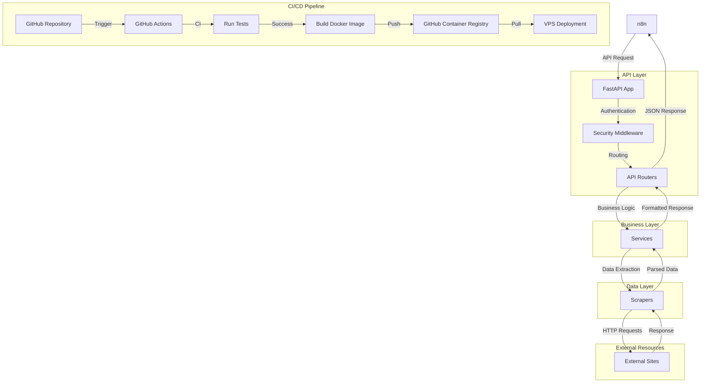
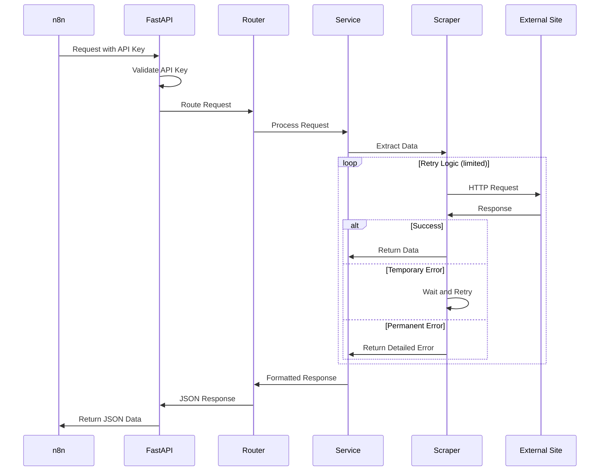

# Architecture du projet techno-scraper

Ce document décrit l'architecture du projet techno-scraper, un système de scraping de données musicales avec deux interfaces : REST API (legacy) et serveur MCP (moderne).

## Objectif du projet

Le projet techno-scraper vise à :

-   Scraper des données de sites musicaux (Soundcloud, Beatport, Bandcamp, ...)
-   **[Nouveau]** Exposer ces données via un serveur MCP (Model Context Protocol) pour intégration native avec les agents IA
-   **[Legacy]** Exposer ces données via une API REST FastAPI (en cours de migration)
-   Fonctionner en local et en production via Docker
-   Être utilisé par n8n et Claude Desktop sur un VPS

## Structure du projet

```
techno-scraper/
├── app/
│   ├── __init__.py
│   ├── main.py                  # [TODO Phase 4] Point d'entrée FastAPI (à supprimer)
│   ├── mcp/                     # [NOUVEAU] Serveur MCP
│   │   ├── __init__.py
│   │   ├── __main__.py          # Point d'entrée: python -m app.mcp.server
│   │   ├── server.py            # Serveur MCP principal
│   │   └── tools/               # Définition des MCP tools
│   │       ├── __init__.py
│   │       ├── soundcloud_tools.py  # Tools SoundCloud (search, get_profile)
│   │       ├── beatport_tools.py    # [TODO Phase 2] Tools Beatport
│   │       └── bandcamp_tools.py    # [TODO Phase 3] Tools Bandcamp
│   ├── core/                    # Fonctionnalités centrales
│   │   ├── __init__.py
│   │   ├── config.py            # Configuration de l'application
│   │   ├── security.py          # Gestion de l'authentification par clé API
│   │   └── errors.py            # Gestion des erreurs et exceptions
│   ├── models/                  # Modèles Pydantic pour la validation des données
│   │   ├── __init__.py
│   │   └── schemas.py           # Schémas de données communs
│   ├── routers/                 # [TODO Phase 4] Endpoints REST API (à supprimer)
│   │   ├── __init__.py
│   │   ├── soundcloud_router.py  # Router pour Soundcloud
│   │   ├── beatport_router.py    # Router pour Beatport
│   │   ├── bandcamp_router.py    # Router pour Bandcamp
│   ├── services/                # Logique métier et services
│   │   ├── __init__.py
│   │   ├── retry_service.py     # Service de retry avec backoff
│   │   ├── pagination_service.py # Service de pagination
│   │   └── soundcloud/          # Services SoundCloud dédiés
│   │       ├── __init__.py
│   │       ├── soundcloud_auth_service.py    # Authentification OAuth 2.1
│   │       └── soundcloud_api_service.py     # Interface API SoundCloud
│   └── scrapers/                # Modules de scraping
│       ├── __init__.py
│       ├── base_scraper.py      # Classe de base pour les scrapers
│       ├── soundcloud/          # Scrapers SoundCloud avec architecture moderne
│       │   ├── __init__.py
│       │   ├── soundcloud_profile_scraper.py        # Scraping de profil
│       │   ├── soundcloud_search_profile_scraper.py # Scraping de recherche
│       │   ├── soundcloud_webprofiles_scraper.py    # Scraping des réseaux sociaux
│       │   └── soundcloud_mapping_utils.py          # Utilitaires de mapping
│       ├── beatport/            # Scrapers pour Beatport
│       │   ├── __init__.py
│       │   ├── beatport_search_scraper.py    # Scraping de recherche
│       │   ├── beatport_releases_scraper.py  # Scraping de releases (artistes/labels)
│       │   └── beatport_mapping_utils.py     # Utilitaires de mapping Beatport
│       ├── bandcamp/            # Scrapers pour Bandcamp
│       │   ├── __init__.py
│       │   ├── bandcamp_search_scraper.py    # Scraping de recherche d'artistes/labels
│       │   └── bandcamp_mapping_utils.py     # Utilitaires de mapping Bandcamp
├── tests/                       # Tests unitaires et d'intégration
│   ├── __init__.py
│   ├── conftest.py              # Configuration des tests
│   ├── mcp/                     # [NOUVEAU] Tests des MCP tools
│   │   ├── __init__.py
│   │   └── test_soundcloud_mcp_tools.py  # Tests tools SoundCloud
│   ├── integration/             # Tests d'intégration REST (legacy)
│   │   ├── mocks/               # Mocks pour les tests d'intégration
│   │   ├── test_api_routes.py   # Tests des routes API générales
│   │   ├── test_bandcamp_router.py # Tests des routes Bandcamp
│   │   ├── test_beatport_router.py  # Tests des routes Beatport
│   │   └── test_soundcloud_router.py # Tests des routes Soundcloud
│   ├── mocks/                   # Mocks réutilisables
│   ├── scrapers/                # Tests unitaires des scrapers
│   │   ├── bandcamp/            # Tests pour Bandcamp
│   │   ├── beatport/            # Tests pour Beatport
│   │   ├── soundcloud/          # Tests pour Soundcloud
│   │   └── conftest.py          # Configuration partagée des scrapers
│   └── services/                # Tests des services
│       ├── soundcloud/          # Tests des services SoundCloud
│       ├── test_retry_service.py # Tests du service de retry
│       └── test_pagination_service.py # Tests du service de pagination
├── .github/                     # Configuration GitHub
│   └── workflows/               # Workflows GitHub Actions
│       ├── deploy.yml           # Workflow de déploiement principal
│       ├── build.yml            # Workflow de construction d'image Docker
│       ├── test.yml             # Workflow d'exécution des tests
│       └── manual-test.yml      # Workflow pour tests manuels
├── scripts/                     # Scripts utilitaires
│   ├── deploy.sh                # Script de déploiement pour GitHub Actions
│   ├── setup_venv.bat           # Script de config venv en local (Windows)
│   ├── setup_venv.sh            # Script de config venv en local (Linux/macOS)
│   ├── run_tests.bat            # Script d'exécution des tests (Windows)
│   └── run_tests.sh             # Script d'exécution des tests (Linux/macOS)
├── .env.example                 # Exemple de variables d'environnement
├── .gitignore                   # Fichiers à ignorer par Git
├── Dockerfile                   # Configuration Docker
├── docker-compose.yml           # Configuration Docker Compose
├── requirements.txt             # Dépendances Python principales
├── requirements-test.txt        # Dépendances pour les tests
├── pytest.ini                   # Configuration pytest
├── mcp_config.json              # Configuration MCP générique
├── claude_desktop_config.json   # Configuration pour Claude Desktop
├── MCP_USAGE.md                 # Documentation d'utilisation MCP
├── N8N_MCP_SETUP.md             # Guide d'intégration n8n avec MCP
└── README.md                    # Documentation du projet
```

## Diagramme d'architecture



## Flux de données



## Flux de déploiement CI/CD

```mermaid
flowchart TD
    A[Push sur GitHub] --> B[Déclenchement du workflow deploy.yml]
    B --> C[Exécution des tests via test.yml]
    C -->|Échec| D[Notification d'échec]
    C -->|Succès| E[Construction de l'image via build.yml]
    E --> F[Publication de l'image sur GitHub Container Registry]
    F --> G[Connexion SSH au VPS]
    G --> H[Déploiement via Docker Compose]
    H --> I[Vérification du déploiement]
```



## Détails des composants principaux

### 0. MCP Layer (Nouveau - Interface moderne)

-   **app/mcp/server.py**: Serveur MCP principal avec gestion des tools
    -   Communication via stdio (JSON-RPC)
    -   Enregistrement et exécution des tools
    -   Logging et gestion d'erreurs
-   **app/mcp/tools/**: Définition des MCP tools par plateforme
    -   **soundcloud_tools.py**: Tools SoundCloud (`soundcloud_search_profiles`, `soundcloud_get_profile`)
    -   **beatport_tools.py**: [À venir Phase 2] Tools Beatport
    -   **bandcamp_tools.py**: [À venir Phase 3] Tools Bandcamp
-   Architecture orientée tools, pas routes
-   Intégration native avec Claude Desktop, n8n MCP, et autres clients MCP
-   Variables d'environnement lues depuis .env
-   **tests/mcp/**: Tests d'intégration des MCP tools

### 1. API Layer (FastAPI - Legacy, à supprimer Phase 4)

-   **main.py**: Point d'entrée de l'application, configuration des middlewares et des routers
-   **core/security.py**: Middleware d'authentification par clé API
-   **routers/**: Endpoints API organisés par site (un router par site)
-   **Note**: Cette couche sera supprimée après migration complète vers MCP

### 2. Business Layer (Services)

-   **services/retry_service.py**: Gestion des retries avec backoff exponentiel
-   **services/pagination_service.py**: Service de pagination réutilisable
-   **services/soundcloud/**: Services SoundCloud dédiés avec architecture moderne
    -   **soundcloud_auth_service.py**: Authentification OAuth 2.1 avec Client Credentials Flow
    -   **soundcloud_api_service.py**: Interface unifiée pour les appels API SoundCloud
-   Logique métier pour transformer les données brutes en réponses API
-   Séparation claire des responsabilités entre authentification et API

### 3. Data Layer (Scrapers)

-   **scrapers/base_scraper.py**: Classe de base avec fonctionnalités communes
-   **scrapers/soundcloud/**: Scrapers SoundCloud avec architecture moderne
    -   Utilisation des services SoundCloud dédiés pour l'authentification et les appels API
    -   Séparation claire entre profils, recherche et réseaux sociaux
    -   Gestion d'erreurs robuste avec exceptions typées
-   **scrapers/beatport/**: Scrapers Beatport avec extraction JSON et gestion des facets  
-   **scrapers/bandcamp/**: Scrapers Bandcamp avec parsing HTML et filtrage par type d'entité
-   Scrapers spécifiques à chaque site, organisés par fonctionnalité

### 4. Test Layer

-   **tests/conftest.py**: Configuration globale et fixtures partagées
-   **tests/integration/**: Tests d'intégration des API et endpoints
    -   Mockent au niveau des scrapers (interface publique)
    -   Testent l'API complète end-to-end
-   **tests/scrapers/**: Tests unitaires pour les scrapers
    -   Tests SoundCloud: mockent les services SoundCloud
    -   Tests Beatport: mockent BaseScraper.fetch
    -   Tests Bandcamp: mockent BaseScraper.fetch
-   **tests/services/**: Tests unitaires pour les services
    -   Tests services SoundCloud: mockent les requêtes HTTP
    -   Tests services génériques: retry, pagination
-   **tests/mocks/**: Mocks optimisés et réutilisables (sans redondances)
    -   Architecture en couches avec mocks appropriés selon le niveau de test

### 5. Configuration Docker

-   **Dockerfile**: Image Docker légère basée sur Python
-   **docker-compose.yml**: Configuration pour le déploiement local et en production

### 6. CI/CD avec GitHub Actions

-   **.github/workflows/deploy.yml**: Workflow principal orchestrant le déploiement complet
-   **.github/workflows/test.yml**: Workflow d'exécution des tests et de génération de rapports de couverture
-   **.github/workflows/build.yml**: Workflow de construction et publication d'image Docker
-   **.github/workflows/manual-test.yml**: Workflow pour exécution manuelle des tests
-   **scripts/deploy.sh**: Script de déploiement sur le VPS

## Sécurité

-   Authentification par clé API simple dans les headers
-   Accès limité au loopback pour usage local
-   Secrets stockés de manière sécurisée dans GitHub Actions

## Gestion des erreurs

-   Combinaison de retries limités avec backoff exponentiel
-   Erreurs explicites détaillées pour faciliter le débogage
-   Logging complet des erreurs et des tentatives

## Tests

-   **Tests unitaires**: Validation des composants individuels
    -   Scrapers: Tests de l'extraction et de la transformation des données
    -   Services: Tests de la logique métier et des retries
-   **Tests d'intégration REST** (legacy): Validation des endpoints FastAPI
    -   API: Tests des routers, validation des entrées/sorties
    -   tests/integration/test_*_router.py
-   **Tests d'intégration MCP** (nouveau): Validation des MCP tools
    -   Tools: Tests de l'exécution et des retours des tools
    -   tests/mcp/test_*_mcp_tools.py
-   **Mocks**: Simulation des API externes pour des tests reproductibles

## Architecture MCP (Model Context Protocol)

### Principe

Le MCP (Model Context Protocol) est un protocole standardisé par Anthropic permettant aux agents IA d'interagir avec des outils externes via JSON-RPC sur stdio.

### Avantages par rapport à REST

- **Intégration native** : Pas besoin de gérer des requêtes HTTP, l'agent appelle directement les tools
- **Typage fort** : Les paramètres sont validés via JSON Schema
- **Communication sécurisée** : Via stdio, pas d'exposition réseau nécessaire
- **Simplification** : Pas besoin de middleware d'authentification, CORS, etc.

### Architecture technique

```
Client MCP (Claude Desktop/n8n)
    ↓ JSON-RPC via stdio
Serveur MCP (app/mcp/server.py)
    ↓ Appel Python direct
MCP Tools (app/mcp/tools/*.py)
    ↓ Appel Python direct
Scrapers (app/scrapers/*.py)
    ↓
Services (app/services/*.py)
    ↓
Sites externes (SoundCloud, Beatport, etc.)
```

### Tools vs Routes

- **REST API** : Une route = un endpoint HTTP (ex: `GET /api/soundcloud/search`)
- **MCP** : Un tool = une fonction Python exposée (ex: `soundcloud_search_profiles`)
- **Granularité** : 1 tool = 1 route (mapping 1:1)

### Configuration

Les clients MCP (Claude Desktop, n8n) configurent le serveur via JSON :

```json
{
  "mcpServers": {
    "techno-scraper": {
      "command": "python",
      "args": ["-m", "app.mcp.server"],
      "cwd": "/path/to/techno-scraper"
    }
  }
}
```

Les variables d'environnement (SOUNDCLOUD_CLIENT_ID, etc.) sont lues depuis le `.env` du projet.

### Migration REST → MCP

**Plan de migration en 4 phases** :

1. **Phase 1** ✅ : Implémentation MCP SoundCloud (coexistence REST + MCP)
2. **Phase 2** 🔄 : Ajout des tools Beatport
3. **Phase 3** 🔄 : Ajout des tools Bandcamp
4. **Phase 4** 📅 : Suppression complète de l'API REST
   - Supprimer `app/main.py`
   - Supprimer `app/routers/`
   - Supprimer `tests/integration/test_*_router.py`
   - Nettoyer les dépendances FastAPI inutiles

**Code métier partagé** : Les scrapers et services restent inchangés pendant toute la migration.

## Informations complémentaires

- **Journal de développement** : [DEVELOPMENT.md](DEVELOPMENT.md) - Modifications récentes et prochaines étapes
- **Guide d'utilisation** : [../README.md](../README.md) - Installation et utilisation de base
